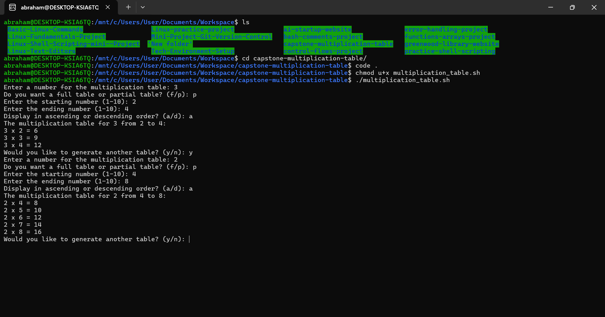

# Capstone Project - Linux Shell Scripting

## Project Overview
This project creates a Bash script to generate a multiplication table based on user input, practicing loops, conditional logic, and user interaction on Ubuntu (WSL) with VS Code via Ubuntu.

## Setup
- Created a new GitHub repository and cloned it to ~/Documents/Workspace/capstone-multiplication-table on Jun 19, 2025, 07:09 AM WAT.
- Used Ubuntu terminal (WSL) with VS Code installed via Ubuntu, accessing /mnt/c/Users/YourUsername/Documents/Workspace/capstone-multiplication-table.

## Script Execution

### Creating and Implementing Multiplication Table Script
- **Edit Script with VS Code**:
  - Command: `code multiplication_table.sh`
  - Purpose: Developed a script with loops and input validation for multiplication tables.
  - Added code:
    ```bash
    #!/bin/bash

    # This script generates a multiplication table based on user input
    # Purpose: Practice loops, conditional logic, and user interaction

    # Function to display multiplication table
    generate_table() {
        local num=$1
        local start=$2
        local end=$3
        local order=$4

        # Validate range
        if [ "$start" -lt 1 ] || [ "$end" -gt 10 ] || [ "$start" -gt "$end" ]; then
            echo "Invalid range. Showing full table from 1 to 10 instead."
            start=1
            end=10
        fi

        echo "The multiplication table for $num from $start to $end:"
        # List form loop for ascending order
        if [ "$order" == "ascending" ]; then
            for i in $(seq $start $end); do
                echo "$num x $i = $((num * i))"
            done
        else
            # List form loop for descending order
            for i in $(seq $end -1 $start); do
                echo "$num x $i = $((num * i))"
            done
        fi
    }

    # Prompt for number and validate
    read -p "Enter a number for the multiplication table: " num
    if ! [[ "$num" =~ ^[0-9]+$ ]]; then
        echo "Error: Please enter a valid positive number."
        exit 1
    fi

    # Ask for table type and range
    read -p "Do you want a full table or partial table? (f/p): " choice
    if [ "$choice" == "f" ]; then
        start=1
        end=10
    elif [ "$choice" == "p" ]; then
        read -p "Enter the starting number (1-10): " start
        read -p "Enter the ending number (1-10): " end
        if ! [[ "$start" =~ ^[0-9]+$ ]] || ! [[ "$end" =~ ^[0-9]+$ ]]; then
            echo "Error: Start and end must be valid numbers."
            exit 1
        fi
    else
        echo "Invalid choice. Defaulting to full table."
        start=1
        end=10
    fi

    # Bonus: Ask for order preference
    read -p "Display in ascending or descending order? (a/d): " order_choice
    order="ascending"
    if [ "$order_choice" == "d" ]; then
        order="descending"
    elif [ "$order_choice" != "a" ]; then
        echo "Invalid order. Defaulting to ascending."
    fi

    # Call function to generate table
    generate_table "$num" "$start" "$end" "$order"

    # Bonus: Offer to repeat
    read -p "Would you like to generate another table? (y/n): " repeat
    if [ "$repeat" == "y" ]; then
        bash "$0"
    fi
    ```
  - Purpose: Uses `read` for input, `if-else` for validation and choice, and a list form `for` loop (via `seq`) with order options.
- **Add Execute Permission**:
  - Command: `chmod u+x multiplication_table.sh`
  - Purpose: Grants execute permission.
- **Run Script**:
  - Command: `./multiplication_table.sh`
  - Purpose: Prompts for number, table type, range, order, and repeat option.
  - Verification: Tests with valid (e.g., 3, p, 2-4, a) and invalid (e.g., 3, p, 8-2) inputs.
  - **Screenshot**: Script execution with output:
    

## Tools Used
- **Ubuntu Terminal (WSL)**: For script execution with VS Code via Ubuntu.
- **VS Code**: For editing the script and `README.md`.
- **Git Bash**: For managing the Git repository on Windows.
- **GitHub**: For hosting the project.

## Learning Summary
This capstone project enhanced my Bash scripting skills by integrating loops, conditional logic, and user interaction to create a multiplication table generator. I mastered the list form `for` loop with `seq` to iterate over user-specified ranges, validated inputs using regex and range checks, and implemented `if-else` statements to handle full/partial table choices and order preferences. The bonus features—order selection (ascending/descending) and repeat functionality—improved user experience, while comments ensured code readability. This project solidified my ability to automate tasks, handle errors, and present clear outputs, preparing me for real-world scripting challenges.

## Repository Link
[GitHub Repository](https://github.com/westgrin/capstone-multiplication-table)

## Conclusion
This capstone project successfully demonstrated my proficiency in Bash scripting, meeting all requirements with enhanced interactivity and robust error handling.